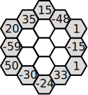
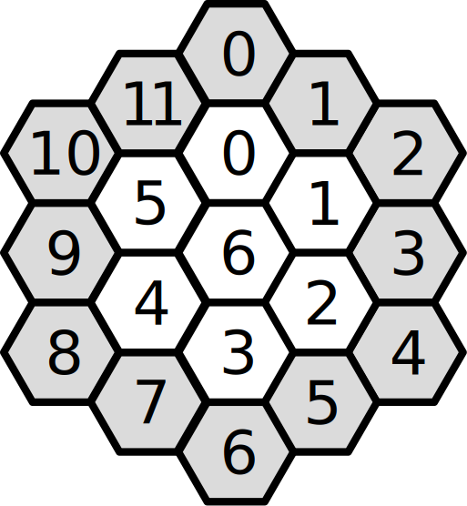

# the sun flower puzzle

## goal
- values in outer combs (gray) are given
- also a choice of values for the inner combs (white) is given
- given values must be placed in inner combs
- each inner comb's value must be the sum of its surrounding combs' values

## sample
- outer values given: 15 -48 1 -15 1 33 -24 -30 50 -59 20 35

- inner values choice: **6 6 7 15 24 -12 -16**

## solution

## sunFlower.py
- uses this filed numbering

